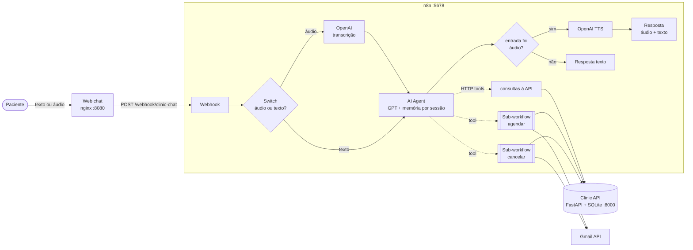
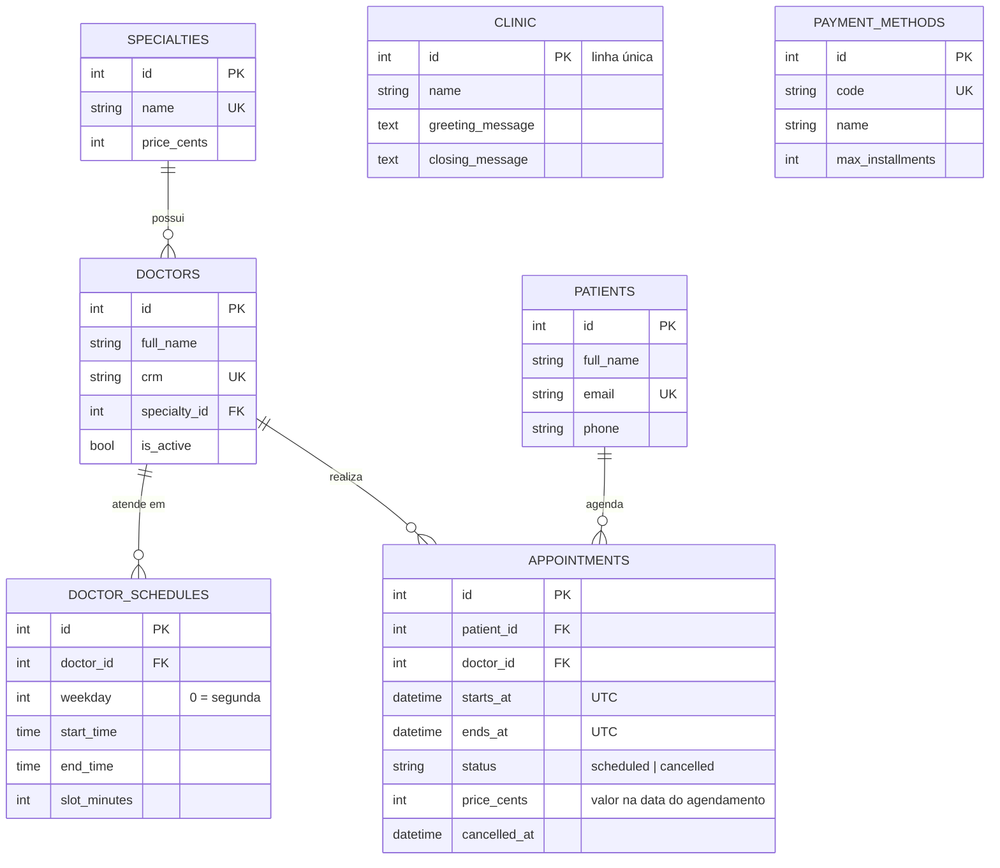

# Essentia Clinic: atendimento médico automatizado com n8n e IA

Case técnico *Especialista em Automações com IA e N8N* da Essentia Technologies.

O paciente conversa com a assistente virtual da **Clínica Essentia Saúde** por **texto ou áudio**. Com isso ele pode:

- consultar horários livres;
- agendar e cancelar consultas, com confirmação por **Gmail**;
- perguntar valores e formas de pagamento.

Quem manda áudio recebe a resposta em áudio (**OpenAI TTS**). Tudo é orquestrado no **n8n**, que usa uma API REST própria em **FastAPI + SQLite**.

## Sumário

1. [Arquitetura](#arquitetura)
2. [Estrutura do repositório](#estrutura-do-repositório)
3. [Pré-requisitos](#pré-requisitos)
4. [Configuração](#configuração)
5. [Execução](#execução)
6. [Como testar](#como-testar)
7. [API REST](#api-rest)
8. [Banco de dados](#banco-de-dados)
9. [Fluxos n8n](#fluxos-n8n)
10. [Decisões técnicas](#decisões-técnicas)
11. [Limitações e próximos passos](#limitações-e-próximos-passos)
12. [Entregáveis](#entregáveis)

## Arquitetura



| Serviço | Imagem | Porta | Papel |
|---|---|---|---|
| `api` | build de `api/` | 8000 | API REST mock com banco SQLite, migrações Alembic e seed |
| `n8n-import` | `n8nio/n8n:2.39.6` | — | Execução única: importa credenciais e workflows e os publica |
| `n8n` | `n8nio/n8n:2.39.6` | 5678 | Orquestração: webhook, agente de IA, tools, Gmail, TTS |
| `web` | `nginx:1.30-alpine` | 8080 | Web chat e painel de consultas (estáticos); proxy de `/webhook/` para o n8n e, para o painel, de duas rotas de leitura da API com a `X-API-Key` injetada pelo nginx |

## Estrutura do repositório

```
api/                    API FastAPI (Python 3.13, uv)
  src/clinic_api/       routers → services → models (SQLAlchemy 2.0)
  migrations/           Alembic (schema versionado)
  tests/                pytest: regras de agenda, conflitos, cache, auth, migrações, seed
n8n/workflows/          export dos 3 workflows (principal, agendar, cancelar)
n8n/bootstrap/          import de credenciais/workflows e publish automáticos
n8n/email-templates/    HTML dos e-mails de confirmação e cancelamento + logo
web/                    web chat e painel de consultas (HTML/CSS/JS) + template do nginx
postman/                coleção e environment do Postman
scripts/                validate_workflows.py e build_email_templates.py (CI), smoke_test.sh
docs/                   checklist de testes, evidências e amostras de áudio
docker-compose.yml      stack completa com healthchecks
Makefile                atalhos (make help)
```

## Pré-requisitos

- Docker com Docker Compose v2.
- `make` e `openssl` (já vêm no macOS e na maioria das distros Linux).
- Chave da **OpenAI** com acesso a `gpt-5-mini`, `whisper-1` e `tts-1`.
- Projeto no **Google Cloud** com a Gmail API (passo a passo abaixo).
- Opcional, para desenvolver a API fora do Docker: [uv](https://docs.astral.sh/uv/).

## Configuração

### 1. Arquivo `.env`

```bash
make env   # cria .env a partir de .env.example com CLINIC_API_KEY e N8N_ENCRYPTION_KEY aleatórias
```

Preencha no `.env`:

| Variável | Uso |
|---|---|
| `OPENAI_API_KEY` | LLM do agente, transcrição e TTS |
| `GOOGLE_OAUTH_CLIENT_ID` / `GOOGLE_OAUTH_CLIENT_SECRET` | Cliente OAuth do Gmail |
| `CLINIC_DEMO_PATIENT_EMAIL` (opcional) | Cria um paciente com o seu e-mail real no seed, para receber as confirmações |

> Os pacientes do seed usam `@example.com`, um domínio reservado: nenhum e-mail chega a uma pessoa real. Para ver a confirmação na sua caixa de entrada, use `CLINIC_DEMO_PATIENT_EMAIL` ou cadastre-se pelo chat com o seu e-mail.

### 2. Credencial do Gmail (Google Cloud)

1. Em [console.cloud.google.com](https://console.cloud.google.com), crie ou selecione um projeto e ative a **Gmail API**.
2. Configure a **OAuth consent screen**:
   - tipo **External**, status **Testing**;
   - adicione como **test user** a conta Google que vai enviar os e-mails.
3. Em **Credentials → Create credentials → OAuth client ID**, escolha o tipo **Web application**.
4. Em *Authorized redirect URIs*, cadastre `http://localhost:5678/rest/oauth2-credential/callback`.
5. Copie *Client ID* e *Client secret* para o `.env`.

## Execução

```bash
make up
```

O comando sobe a stack na ordem certa:

1. `api` roda as migrações e o seed e fica *healthy*.
2. `n8n-import` cria as credenciais a partir do `.env`, importa os workflows e os publica.
3. `n8n` inicia com os webhooks de produção ativos.
4. `web` sobe o chat.

`make ps` mostra o status e `make logs` acompanha os logs.

| URL | O que é |
|---|---|
| http://localhost:8080 | Web chat do paciente |
| http://localhost:5678 | Editor do n8n |
| http://localhost:8080/painel.html | Painel de consultas: agenda por período, médico e status |
| http://localhost:8000/docs | Swagger da API (use **Authorize** com a `CLINIC_API_KEY`) |

### Primeiro acesso ao n8n: conectar o Gmail

1. Abra http://localhost:5678 e crie a conta de owner local.
2. Vá em **Overview → Credentials → Gmail (Clinic)** e clique em **Sign in with Google**. Autorize com a conta cadastrada como *test user*.

As credenciais `OpenAI (Clinic)` e `Clinic API key` já vêm preenchidas pelo bootstrap.

> Se você mudar `OPENAI_API_KEY` ou as chaves do Google no `.env`, rode `make up` de novo: o bootstrap só reimporta o que mudou. O token do Gmail é preservado enquanto o client ID e o secret forem os mesmos.

### Comandos úteis

| Comando | Descrição |
|---|---|
| `make up` / `make down` | Sobe ou derruba a stack (mantém os volumes) |
| `make reset` | Derruba e **apaga** os volumes (banco e dados do n8n) |
| `make n8n-sync` | Para o n8n, reimporta e publica os workflows do repositório e sobe de novo (credenciais e token do Gmail são preservados) |
| `make n8n-export` | Exporta os workflows editados na UI de volta para `n8n/workflows/` |
| `make email-templates` | Injeta os templates de `n8n/email-templates/` nos nodes do Gmail |
| `make email-preview` | Gera o preview dos e-mails com dados de exemplo em `tmp/email-preview/` |
| `make verify` | Gate local: lint, mypy strict, testes com cobertura, validação dos workflows e dos templates de e-mail |
| `make smoke` | Smoke test ponta a ponta contra a stack rodando |
| `make api-dev` | API local com reload, fora do Docker |

## Como testar

### Pelo web chat

Abra http://localhost:8080, escreva ou toque no microfone para gravar. A interface segue o WhatsApp Web (tema claro e escuro): lista de conversas à esquerda com busca, filtro de não lidas e botão de nova conversa; chat à direita com nota de voz (forma de onda e transcrição), status "digitando…" e confirmação de leitura. Cada conversa é uma sessão própria do agente e o histórico, com os áudios, fica no IndexedDB do navegador. Roteiros sugeridos:

- **Horários:** "Quais horários de cardiologia estão livres esta semana?"
- **Agendamento:** "Quero agendar dermatologia" → informe o e-mail → nome e telefone, se for paciente novo → escolha o horário → confirme. A confirmação chega por e-mail.
- **Cancelamento:** "Quero cancelar minha consulta" → informe o e-mail → escolha a consulta → confirme. O aviso chega por e-mail.
- **Valores:** "Quanto custa a consulta e como posso pagar?"
- **Áudio:** grave qualquer uma das perguntas acima; a resposta volta em áudio, com transcrição e texto.

### Painel de consultas

Abra http://localhost:8080/painel.html. A página lista as consultas do período (padrão: próximos 7 dias) agrupadas por dia, com filtros de médico e status, atalhos de período e um resumo com o total agendado, cancelado e o valor previsto. Agende ou cancele pelo chat e clique em **Atualizar** para ver a mudança. O navegador nunca recebe a API key: o nginx faz proxy só de `GET /api/v1/appointments` e `GET /api/v1/doctors`, injetando o header (ver [Decisões técnicas](#decisões-técnicas)).

### Por linha de comando

```bash
# texto → texto
curl -s -X POST localhost:8080/webhook/clinic-chat \
  -F session_id=demo -F "message=Quais as formas de pagamento?" | jq

# áudio → áudio (amostra em docs/samples; no macOS, afplay toca o mp3)
curl -s -X POST localhost:8080/webhook/clinic-chat \
  -F session_id=demo-audio -F "audio=@docs/samples/pergunta-pagamento.wav" \
  | tee /tmp/reply.json | jq -r .audio.base64 | base64 --decode > /tmp/reply.mp3 && afplay /tmp/reply.mp3
```

**Contrato do webhook** (`POST /webhook/clinic-chat`, `multipart/form-data` ou JSON):

| Campo | Tipo | Descrição |
|---|---|---|
| `session_id` | texto | Identifica a conversa (memória do agente) |
| `message` | texto | Mensagem de texto |
| `audio` | arquivo | Mensagem de voz (webm, m4a, ogg, wav, mp3; até 25 MB) |

Exemplo de resposta a uma mensagem de áudio:

```json
{
  "type": "audio",
  "session_id": "demo-audio",
  "transcript": "Quais são os valores das consultas e as formas de pagamento?",
  "reply_text": "A consulta de cardiologia custa 380 reais...",
  "audio": { "mime_type": "audio/mpeg", "base64": "SUQzBAAAAA..." }
}
```

Mensagens de texto recebem `type: "text"` e `audio: null`. Se o TTS falhar mesmo após as retentativas, a resposta a um áudio volta em texto com `audio_error: "TTS_FAILED"`. Falhas voltam com `reply_text` amigável e `error.code`:

| Código | HTTP | Quando |
|---|---|---|
| `INVALID_REQUEST` | 400 | Nem `message` nem `audio` |
| `TRANSCRIPTION_FAILED` | 422 | Áudio que não pôde ser transcrito |
| `AGENT_FAILED` | 502 | Erro do LLM |

### Postman

Importe `postman/essentia-clinic.postman_collection.json` e o environment `postman/essentia-clinic-local.postman_environment.json`, e defina `api_key` com a `CLINIC_API_KEY` do `.env`. As pastas encadeiam variáveis e podem rodar no *Collection Runner* ou via CLI:

```bash
npx newman run postman/essentia-clinic.postman_collection.json \
  -e postman/essentia-clinic-local.postman_environment.json --env-var "api_key=<CLINIC_API_KEY>"
```

### Testes automatizados

```bash
make verify   # ruff + mypy --strict + pytest (cobertura) + validação dos workflows e dos templates de e-mail
make smoke    # stack rodando: API, webhook e, com OPENAI_API_KEY, um turno de texto e um de áudio
```

O resultado dos cenários manuais e automatizados está em [`docs/CHECKLIST_TESTES.md`](docs/CHECKLIST_TESTES.md).

## API REST

Base: `http://localhost:8000/api/v1`. Todas as rotas exigem o header `X-API-Key`, menos `/health`. A documentação interativa fica em `/docs`.

| Método | Rota | Descrição |
|---|---|---|
| GET | `/health` | Liveness + conectividade com o banco |
| GET | `/clinic` | Dados da clínica e mensagens de **saudação e encerramento** |
| GET | `/specialties` | Especialidades com valor da consulta |
| GET | `/doctors?specialty_id=` | Médicos ativos, especialidade e horários de atendimento |
| GET | `/availability?specialty_id=&doctor_id=&date_from=&date_to=` | Horários livres (padrão: próximos 7 dias; máximo 14) |
| GET | `/payment-info` | Valores por especialidade + formas de pagamento |
| GET | `/patients?email=` | Busca por e-mail (lista vazia se não existir) |
| POST | `/patients` | Cadastra paciente |
| GET | `/patients/{id}` | Detalhe do paciente |
| GET | `/patients/{id}/appointments?status=&upcoming=` | Consultas do paciente |
| GET | `/appointments?date_from=&date_to=&status=&doctor_id=` | Consultas do período, incluindo canceladas (alimenta o painel) |
| POST | `/appointments` | **Agenda** consulta |
| GET | `/appointments/{id}` | Detalhe da consulta |
| POST | `/appointments/{id}/cancel` | **Cancela** consulta (exige o e-mail do paciente) |

**Erros:** todos seguem o mesmo envelope, `{"error": {"code": "SLOT_UNAVAILABLE", "message": "...", "details": {...}}}`.

| HTTP | Códigos |
|---|---|
| 401 | `INVALID_API_KEY` |
| 404 | `*_NOT_FOUND`, `CLINIC_NOT_CONFIGURED` (seed não rodou) |
| 409 | `SLOT_UNAVAILABLE`, `PATIENT_TIME_CONFLICT`, `APPOINTMENT_ALREADY_BOOKED`, `APPOINTMENT_ALREADY_CANCELLED`, `PATIENT_EMAIL_ALREADY_EXISTS` |
| 422 | `SLOT_IN_PAST`, `SLOT_OUTSIDE_SCHEDULE`, `APPOINTMENT_IN_PAST`, `INVALID_DATE_RANGE`, `DATE_RANGE_TOO_LARGE`, `VALIDATION_ERROR` |
| 500 | `INTERNAL_ERROR` (erro inesperado, registrado no log) |

**Regras de negócio:**

- **Disponibilidade calculada.** A agenda semanal do médico, menos as consultas ativas e os horários passados. Os dados de demonstração nunca "vencem".
- **Disponibilidade em cache.** Cada combinação de filtros fica em cache por 60 s. Agendar ou cancelar invalida o cache na hora, então a agenda nunca mostra um horário que acabou de ser ocupado. Detalhes em [Decisões técnicas](#decisões-técnicas).
- **Validação do agendamento.** Só aceita um horário que exista na grade do médico; o gerador de slots é o mesmo usado pela disponibilidade.
- **Sem dupla reserva.** Índices únicos parciais no banco (`WHERE status = 'scheduled'`), mais checagem de sobreposição para o paciente. Consultas canceladas liberam o horário e ficam no histórico.
- **Cancelamento.** Mantém o registro, recusa consultas passadas e exige o e-mail do paciente. Se o e-mail não bater, a API responde 404, para não confirmar a existência de consultas de terceiros.
- **Fuso horário.** Datas gravadas em UTC; entrada e saída no fuso da clínica com offset explícito (`2026-09-17T09:00:00-03:00`).

## Banco de dados

SQLite com schema versionado no Alembic (`api/migrations`): `0001` cria o schema e `0002` adiciona o índice de `starts_at` usado pela listagem por período. O seed é idempotente e roda a cada subida da API.



O seed cria a clínica e quatro especialidades:

| Especialidade | Valor |
|---|---|
| Clínica Geral | R$ 250 |
| Cardiologia | R$ 380 |
| Dermatologia | R$ 320 |
| Pediatria | R$ 300 |

Também cria:

- quatro médicos com agendas diferentes, incluindo intervalo de almoço e sábado;
- cinco pacientes fictícios;
- quatro formas de pagamento: Pix, crédito em até 3x, débito e dinheiro;
- consultas de exemplo: futuras, uma cancelada e uma passada.

## Fluxos n8n

Os workflows ficam em `n8n/workflows/` e são importados e publicados automaticamente. No canvas, os nomes dos nodes, as *sticky notes* de cada etapa e a legenda sob cada node estão em português. Só os nomes das ferramentas do agente ficam em `snake_case` (`check_availability`, `book_appointment`…): no n8n, o nome do node é o identificador da função que o modelo chama.

### `Clínica – Chat principal`

1. **Receber mensagem do chat** (Webhook, `responseNode`) recebe `multipart` ou JSON.
2. **Rotear por tipo de mensagem** (Switch) decide pelo conteúdo:
   - arquivo `audio` → **Transcrever áudio** (OpenAI Whisper, pt);
   - campo `message` → texto;
   - nenhum dos dois → *fallback* `400`.
3. **Normalizar entrada de áudio** / **de texto** (Set) padronizam `{session_id, message, input_type}`.
4. **Assistente da clínica** (AI Agent) responde:
   - modelo `gpt-5-mini`;
   - **Memória da conversa** por `session_id`;
   - system prompt com data e hora atuais e regras de atendimento. Pede confirmação explícita antes de agendar ou cancelar e manda responder sem markdown quando a resposta vai virar áudio.
5. As **ferramentas** chamam a API com a credencial *Header Auth*:
   - `get_clinic_info`: saudação e encerramento;
   - `list_doctors`;
   - `check_availability`;
   - `get_payment_info`;
   - `find_patient_by_email`;
   - `register_patient`;
   - `list_patient_appointments`.
6. **Responder em áudio?** (If): quando a entrada foi áudio, **Gerar voz** (OpenAI TTS `tts-1`) → **Converter áudio em base64** → **Responder com áudio**; caso contrário, **Responder com texto**.
7. **Retentativa e saídas de erro.** Transcrição e TTS tentam até 3 vezes (1,5 s entre tentativas) antes de cair no tratamento de erro:
   - transcrição falhou → `422`;
   - agente falhou → `502`;
   - TTS falhou → responde só em texto.

### `Clínica – Agendar consulta` e `Clínica – Cancelar consulta`

São sub-workflows expostos ao agente como as tools `book_appointment` e `cancel_appointment` (*Call n8n Workflow Tool*).

1. Chamam a API: **Buscar paciente por e-mail** e **Criar consulta na API** (`POST /appointments`), ou **Cancelar consulta na API** (`POST /appointments/{id}/cancel`).
2. Ramificam pelo status HTTP (**Consulta criada?** / **Consulta cancelada?**).
3. Em caso de sucesso, **Buscar dados da clínica**, formatam os campos no node **Preparar e-mail** e enviam um **e-mail HTML pelo Gmail**.
4. Devolvem ao agente `{ ok, email_sent, appointment | error }`.

Nesta entrega o destinatário é **fixo** (`felipesantosmarcelino2004@gmail.com`, no campo *To* dos dois nodes do Gmail), para que toda confirmação e todo cancelamento cheguem a uma caixa real mesmo quando o paciente de teste usa um e-mail `@example.com`. O endereço nunca vem do texto gerado pelo modelo. Se o Gmail falhar, o node tenta de novo até 3 vezes; persistindo a falha, o agendamento continua válido e o agente avisa que o e-mail não foi enviado (`email_sent: false`).

### E-mails de confirmação

| Arquivo | Uso |
|---|---|
| `n8n/email-templates/layout.html` | Estrutura comum: header com o logo, card e rodapé com os dados da clínica |
| `n8n/email-templates/appointment-booked.html` | Consulta confirmada: data e horário, detalhes, botões **Adicionar à agenda** (Google Agenda) e **Como chegar** (Google Maps) |
| `n8n/email-templates/appointment-cancelled.html` | Cancelamento confirmado, com o convite para remarcar |
| `n8n/email-templates/assets/` | Imagens dos e-mails (logo PNG otimizado, 4,6 KB) |

- **Compatível com clientes de e-mail.** Layout em tabelas com estilos inline, largura máxima de 600 px, responsivo no celular e com ajustes para o Outlook.
- **Templates sem lógica.** Só aceitam `{{ $json.<campo> }}`. Datas, links e o escape do nome do paciente ficam no node **Preparar e-mail**.
- **Build.** O `scripts/build_email_templates.py` injeta o HTML no node do Gmail de cada workflow. No CI, `--check` falha se um template não foi reconstruído ou se usa um campo que o **Preparar e-mail** não define.
- **Logo.** Clientes de e-mail só carregam imagens de URL pública. Por isso o logo é servido do GitHub (`raw.githubusercontent.com`, branch `main`) e só aparece depois do push. Até lá, o header mostra o nome da clínica como texto alternativo.

Para alterar um e-mail:

1. Edite o HTML em `n8n/email-templates/`.
2. Rode `make email-preview` e abra `tmp/email-preview/` no navegador. O preview usa dados de exemplo.
3. Rode `make email-templates` para atualizar os workflows e `make n8n-sync` para publicar.

### Editando os fluxos

1. Edite na UI do n8n.
2. Rode `make n8n-export`.
3. Revise o diff e faça commit.
4. Confira os JSONs com `make validate-workflows` (o CI roda a mesma checagem).

Na volta, `make n8n-sync` publica o que estiver no repositório.

## Decisões técnicas

- **Webhook + web chat próprio, em vez do Chat Trigger embutido.** O chat nativo não grava do microfone nem toca áudio de resposta. O webhook com contrato explícito serve ao web chat, ao Postman e ao curl. O histórico de conversas fica só no navegador (IndexedDB): o `session_id` de cada conversa é o que liga a página à memória do agente no n8n.
- **Diferenciação multimodal pelo conteúdo.** O fluxo não depende de um campo `type` do cliente: se chegou arquivo `audio`, é áudio.
- **Agendar e cancelar como sub-workflows.** A chamada à API e o e-mail ficam determinísticos. O LLM decide *quando* agir, mas não monta o e-mail nem escolhe o destinatário. Um retry do modelo cai em `409 APPOINTMENT_ALREADY_BOOKED` e não gera e-mail duplicado.
- **API síncrona (SQLAlchemy 2.0 sync).** O driver do SQLite é síncrono e o FastAPI roda endpoints `def` em threadpool. Async só adicionaria complexidade.
- **Cache de disponibilidade em memória** ([`cache.py`](api/src/clinic_api/cache.py), usado por [`services/availability.py`](api/src/clinic_api/services/availability.py)):
  - **Chave:** período já resolvido, especialidade e médico. TTL de 60 s (`CLINIC_AVAILABILITY_CACHE_TTL_SECONDS`, `0` desliga) e no máximo 256 entradas, com descarte LRU.
  - **Invalidação na escrita:** os services de agendamento e cancelamento limpam o cache depois do commit. O TTL só limita a defasagem de mudanças feitas fora da API, como o seed ou uma edição direta no banco.
  - **Horários passados** são filtrados a cada leitura, não na hora de guardar. Uma entrada em cache nunca oferece um horário que já começou.
  - **Corrida entre leitura e escrita:** se um agendamento invalida o cache enquanto outra requisição ainda calcula a agenda, esse resultado é devolvido, mas não é guardado (contador de geração).
  - **Nada do ORM no cache:** as entradas são dataclasses imutáveis, seguras para compartilhar entre as threads do FastAPI. Erros (médico inexistente, período inválido) não são cacheados.
  - **Ganho medido** com o seed (4 médicos, 14 dias): ~1,9 ms → ~1,3 ms por requisição. Nessa escala o custo é dominado por HTTP e serialização. O que o cache elimina são as duas consultas ao banco de cada leitura, e o ganho cresce com o número de médicos e de consultas.
- **Painel de consultas sem expor a API key.** A página é estática e consulta a API pelo nginx, que faz proxy apenas de `GET /api/v1/appointments` e `GET /api/v1/doctors` e injeta a `X-API-Key` a partir do `.env` (`web/nginx.conf.template`, renderizado pelo `envsubst` da imagem oficial). Qualquer outro método ou rota em `/api/` recebe `403`/`404`. O nginx resolve `api` e `n8n` pelo DNS do Docker a cada 10 s, então recriar um container não derruba o proxy.
- **Camadas enxutas:** routers → services → models. Os services lançam erros de domínio (`AppError`), mapeados para o envelope HTTP em um único lugar.
- **Bootstrap idempotente do n8n.** Credenciais e workflows versionados, importados só quando mudam, com IDs fixos para as referências entre workflows.
- **Qualidade:**
  - `ruff`, `mypy --strict`, 97 testes com 98% de cobertura (mínimo de 95% exigido no `pyproject.toml`), incluindo as corridas de agendamento e de cadastro resolvidas pelos índices únicos;
  - teste que garante que a migração bate com os models;
  - validação estática dos workflows: versões de node, conexões, referências `$('node')` nas expressões, credenciais provisionadas e a retentativa obrigatória nos nodes de Gmail e OpenAI (áudio);
  - CI no GitHub Actions.

## Limitações e próximos passos

- A **memória do agente** fica na RAM do n8n e se perde ao reiniciar. Em produção: Postgres ou Redis Chat Memory.
- O **e-mail como prova de posse** no cancelamento não é autenticação real. Em produção: código de verificação (OTP) por e-mail ou WhatsApp.
- O node nativo de transcrição do n8n usa o **`whisper-1` fixo**, que a OpenAI já trata como modelo legado. Se ele for descontinuado, a troca é um HTTP Request multipart para `/v1/audio/transcriptions` com um modelo de transcrição atual da OpenAI, usando a mesma credencial.
- A **checagem de sobreposição parcial** do paciente (duas consultas em médicos com grades diferentes, ex.: 8h15–9h15 e 8h30–9h00) roda na aplicação, fora do lock de escrita do SQLite. Os índices únicos parciais garantem no banco o caso relevante para a demo, o mesmo horário de início. Em produção, `BEGIN IMMEDIATE` (SQLite) ou `SELECT … FOR UPDATE` (Postgres) fecharia essa janela.
- **SQLite** atende o mock. O modelo já declara os índices parciais também para Postgres (`postgresql_where`), o que facilita a migração.
- O **cache de disponibilidade** é por processo, e a API roda com um único worker. Com várias réplicas, cada uma invalidaria só o próprio cache. O passo seguinte seria Redis com chave versionada (`availability:v{n}:…`) e `INCR` da versão a cada agendamento ou cancelamento.
- O **painel de consultas** é somente leitura e, como todo o resto da demo, não tem login: quem acessa a porta 8080 vê a agenda. Em produção ficaria atrás de autenticação (por exemplo, OAuth da clínica) e o nginx só injetaria a chave para sessões autenticadas.
- **Canal:** o mesmo webhook pode ser ligado a WhatsApp ou Telegram trocando só a camada de entrada e saída.

## Entregáveis

| Item | Onde |
|---|---|
| Código da API | [`api/`](api) |
| Banco configurado com dados iniciais | [`api/migrations`](api/migrations) + [`api/src/clinic_api/seed.py`](api/src/clinic_api/seed.py) |
| Export dos fluxos n8n | [`n8n/workflows/`](n8n/workflows) |
| Instruções de execução e teste | este README |
| Coleção Postman | [`postman/`](postman) |
| Vídeo/GIF de demonstração | [`docs/demo/`](docs/demo) (roteiro em `ROTEIRO.md`; gravação a adicionar) |
| Checklist de testes e evidências | [`docs/CHECKLIST_TESTES.md`](docs/CHECKLIST_TESTES.md) + [`docs/evidencias/`](docs/evidencias) |
